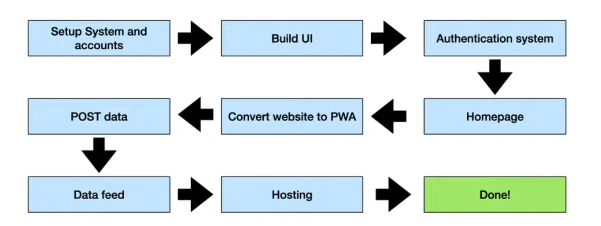

## Tech Stack

HTML, CSS, JS, Bootstrap, Firebase, Mapbox, Leaflet JS, NgRok

## System Design 

## How to Use

Run the index.html with liveserver

open vscode and click on "snapmapgit" directory

deploying: 

run npx firebase init in the main directory (first do npm i --force to get all pckgs first)

click hosting and github deploys (space bar to choose it then enter)

use an existing project

snapmap-gis

WEBSITE LINK

https://snapmap-gis.web.app
